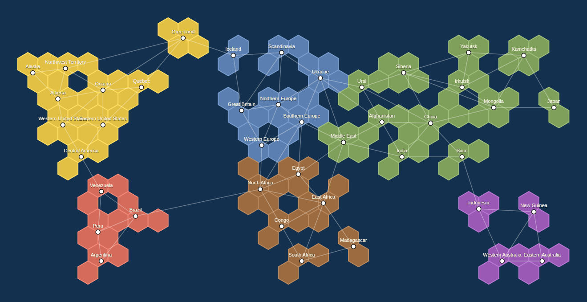

# Risk · Hex Map & Graph

Reconstructing the classic **Risk** board as a tiled hexagon map in **three.js**, with a
**graph overlay** (territories = nodes, borders = edges) as the foundation for exploring the
board through graph theory.



## The idea

The board's truly important asset is its **adjacency graph**, not the picture. So the project is
split into two layers:

- **Data layer** — canonical, render-agnostic. Drives both the map and all future analysis.
  - [`data/territories.json`](data/territories.json) — the 42 territories, 6 continents (with
    reinforcement bonuses), and the full adjacency list, including the non-geographic sea routes
    (Alaska↔Kamchatka, Brazil↔North Africa, Western Europe↔North Africa, Siam↔Indonesia, …).
  - [`data/hexmap.json`](data/hexmap.json) — each territory as a cluster of offset hexagons, so
    countries tile together cleanly. This is the layer to edit when refining map shapes.
- **View layer** — [`src/main.js`](src/main.js) renders the hexes as extruded prisms in three.js,
  coloured by continent, with the graph drawn above the tiles.

Hex math (offset ↔ pixel, centroids, bounds) lives in [`src/hex.js`](src/hex.js) and is shared by
the browser app and the Node preview tool, so the map and the graph never drift apart.

## Run it

```bash
npm install
npm run dev        # three.js app at http://localhost:5173
```

Drag to orbit, scroll to zoom, hover a territory for its continent/bonus/border count. Toggle the
graph overlay and labels from the HUD.

## Tooling

```bash
npm run validate     # assert 42 territories, symmetric adjacency, clean hex tiling
npm run map-preview  # render the hex map to preview.png (no browser needed)
```

`validate` currently confirms: **42 territories · 83 undirected edges · 6 continents** with the
canonical sizes (NA 9, SA 4, EU 7, AF 6, AS 12, AU 4).

## Status

- [x] Canonical territory + adjacency data
- [x] Hexagon reconstruction of all 42 territories
- [x] three.js map rendering, continent colouring, hover
- [x] Graph overlay (nodes + edges)
- [ ] Refine hex shapes to hug the classic outlines more closely
- [ ] Graph-theory analysis: centrality, chokepoints, continent defensibility, cut vertices

## Roadmap toward graph theory

Once the map feels right, the same `territories.json` feeds questions like:
- **Which territories are most important?** — degree / betweenness centrality.
- **Where are the chokepoints?** — cut vertices and bridges (e.g. Central America, the
  Australia/Asia link at Siam).
- **How defensible is a continent?** — count and location of its border territories.
